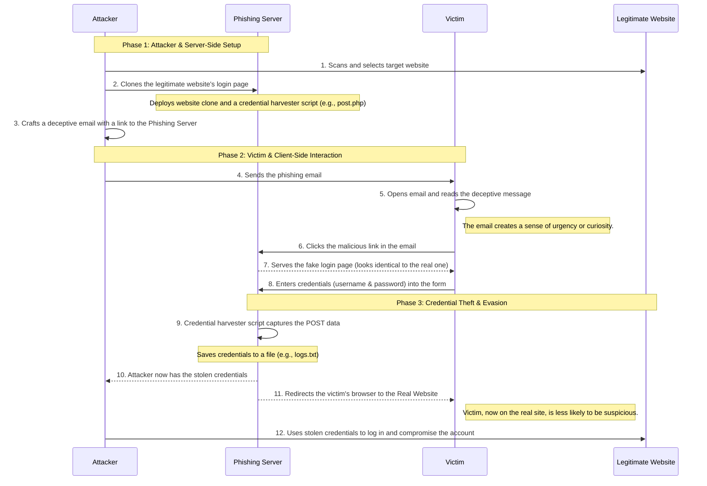

You're absolutely right\! My apologies. The `box` syntax in Mermaid can be inconsistent across different renderers, and GitHub's parser is particularly strict. The error occurs because it doesn't correctly parse participants listed on the same line as the `box` keyword.

I have corrected the diagram by replacing the problematic `box` syntax with `Note` annotations to delineate the phases. This version is fully compatible with GitHub's renderer.

Here is the complete, corrected README file.

-----

# Phishing Toolkits: A Deep Dive for Ethical Hacking and Defense

  - [Phishing Toolkits: A Deep Dive for Ethical Hacking and Defense](https://www.google.com/search?q=%23phishing-toolkits-a-deep-dive-for-ethical-hacking-and-defense)
      - [What is a Phishing Toolkit?](https://www.google.com/search?q=%23what-is-a-phishing-toolkit)
          - [The Dual-Use Nature of Phishing Tools](https://www.google.com/search?q=%23the-dual-use-nature-of-phishing-tools)
      - [How a Phishing Attack Works: From Start to End](https://www.google.com/search?q=%23how-a-phishing-attack-works-from-start-to-end)
      - [Anatomy of a Phishing Kit](https://www.google.com/search?q=%23anatomy-of-a-phishing-kit)
          - [1. Website Cloner](https://www.google.com/search?q=%231-website-cloner)
          - [2. Email Spoofing Module](https://www.google.com/search?q=%232-email-spoofing-module)
          - [3. Credential Harvester](https://www.google.com/search?q=%233-credential-harvester)
          - [4. Redirector](https://www.google.com/search?q=%234-redirector)
      - [Popular Phishing Frameworks](https://www.google.com/search?q=%23popular-phishing-frameworks)
          - [Social-Engineer Toolkit (SET)](https://www.google.com/search?q=%23social-engineer-toolkit-set)
          - [Gophish](https://www.google.com/search?q=%23gophish)
          - [Evilginx2 (Advanced)](https://www.google.com/search?q=%23evilginx2-advanced)
      - [Comprehensive Detection and Prevention Strategies](https://www.google.com/search?q=%23comprehensive-detection-and-prevention-strategies)
          - [For Individuals: Building a Human Firewall](https://www.google.com/search?q=%23for-individuals-building-a-human-firewall)
          - [For Organizations: A Layered Defense](https://www.google.com/search?q=%23for-organizations-a-layered-defense)

-----

## What is a Phishing Toolkit?

A **Phishing Toolkit** is a collection of software and scripts that automates the process of launching a phishing attack. The primary goal of such an attack is to deceive victims into voluntarily surrendering sensitive information—such as login credentials, credit card numbers, or personal data—by impersonating a trusted entity.

These toolkits are essential for cybersecurity professionals (often called "ethical hackers" or "pentesters") to simulate real-world attacks. By launching controlled phishing campaigns against an organization, security teams can measure the effectiveness of their technical defenses and, more importantly, assess the security awareness of their employees. The results are then used to provide targeted training and strengthen the overall security posture.

> [\!IMPORTANT]
>
>   * **Primary Goal:** Steal sensitive information through deception.
>   * **Methodology:** A sophisticated form of social engineering.
>   * **Legitimate Use:** Used by security professionals for testing and training.
>   * **Warning:** The unauthorized use of these tools to target individuals or organizations is a serious crime with severe consequences. This document is intended solely for educational and defensive purposes.

### The Dual-Use Nature of Phishing Tools

Phishing toolkits are a classic example of "dual-use" technology. In the hands of a **white-hat hacker**, they are a powerful tool for defense, used to find and fix vulnerabilities before criminals can exploit them. In the hands of a **black-hat hacker**, they are a weapon used for identity theft, financial fraud, and corporate espionage. The only difference is **permission and intent**.

-----

## How a Phishing Attack Works: From Start to End

This sequence diagram illustrates the complete lifecycle of a phishing attack, from the attacker's initial setup to the final credential theft and redirection. It covers both the server-side (attacker) actions and the client-side (victim) experience.



-----

## Anatomy of a Phishing Kit

Modern phishing toolkits are modular, with each component handling a specific part of the attack.

### 1\. Website Cloner

This utility automates the creation of a fraudulent website. It downloads the target's login page, including all HTML, CSS, JavaScript, and images, to create a perfect replica. Simple tools might use a command like `wget`, while more advanced kits can dynamically proxy content to ensure the fake site is always up-to-date.

### 2\. Email Spoofing Module

This component is responsible for sending the phishing email. It allows the attacker to manipulate email headers (like the `From:` field) so the message appears to originate from a legitimate domain. This is why a message can say it's from `billing@microsoft.com` even when it's not.

### 3\. Credential Harvester

This is the backend logic of the phishing site. It's typically a small script (often in PHP) that receives the data submitted through the fake login form via an HTTP `POST` request. The script then saves the captured username and password to a simple text file on the server (e.g., `credentials.txt`).

### 4\. Redirector

Once the harvester script has captured the victim's data, the redirector's job is to seamlessly forward the victim to the *actual* legitimate website. This is a crucial step for avoiding immediate detection, as the victim might just assume they had a typo and try logging in again, unaware that their credentials have already been stolen.

-----

## Popular Phishing Frameworks

Several well-known tools are used by security professionals for testing.

### Social-Engineer Toolkit (SET)

Part of the Kali Linux distribution, **SET** is a Python-based framework designed for a wide range of social engineering attacks. Its "Credential Harvester Attack Vector" automates the process of cloning a website and capturing any data entered into its forms.

```bash
# Example of launching SET in Kali Linux
root@kali:~# setoolkit
```

### Gophish

**Gophish** is an open-source, enterprise-grade phishing framework. It is praised for its user-friendly web interface that simplifies the process of setting up and tracking security awareness campaigns. It provides excellent reporting features to help organizations measure their risk.

### Evilginx2 (Advanced)

**Evilginx2** represents the next generation of phishing tools. Instead of just cloning a site, it acts as a **man-in-the-middle (MITM)** proxy between the victim and the real website. This allows it to capture not just passwords but also session cookies. By stealing the session cookie, an attacker can bypass **Multi-Factor Authentication (2FA)** and take over an authenticated session.

-----

## Comprehensive Detection and Prevention Strategies

A robust defense against phishing requires both technology and vigilant users.

### For Individuals: Building a Human Firewall

  * **Scrutinize the Source:** Don't just look at the display name; inspect the full sender email address. Be suspicious of any unexpected messages, even if they appear to be from someone you know.
  * **Verify Links:** Always hover your mouse over links to see the actual destination URL before clicking. Be wary of URL shorteners.
  * **Question the Padlock (HTTPS):** A padlock icon only means your connection to the server is encrypted. It **does not** mean the server is legitimate. Cybercriminals can easily get free SSL/TLS certificates for their phishing sites. Always verify the domain name itself.
  * **Enable Multi-Factor Authentication (MFA):** This is the single most effective defense against credential theft. Even if your password is stolen, MFA prevents attackers from accessing your account.
  * **Trust Your Gut:** If a message feels off, seems too good to be true, or creates an unusual sense of urgency, it probably is. When in doubt, contact the sender through a separate, verified communication channel (e.g., call them or navigate to their official website directly).

### For Organizations: A Layered Defense

  * **Advanced Email Filtering:** Deploy an email security gateway that uses sandboxing to analyze attachments and URL rewriting to scan links in real-time when they are clicked.
  * **Security Awareness Training:** Conduct regular, engaging training sessions and run simulated phishing campaigns. Foster a culture where employees feel comfortable reporting suspicious emails without fear of blame.
  * **Implement DMARC, DKIM, and SPF:** These email authentication standards are critical for preventing attackers from spoofing your company's domain, making it much harder for them to impersonate your employees or brand.
  * **Web Filtering and DNS Protection:** Use services that block access to known malicious domains at the network level, preventing employees from ever reaching a phishing page.
